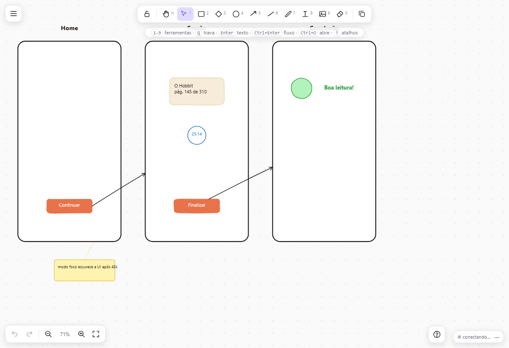
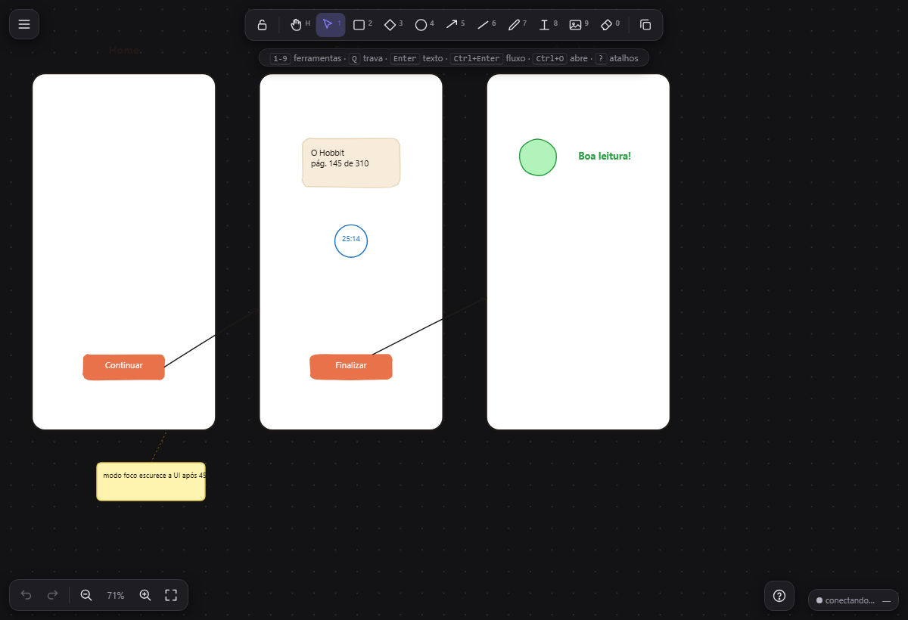

# Drawrdis

Whiteboard local-first com visual desenhado à mão, feito para um novo tipo de colaboração: **você desenha, seu agente de IA vê — e desenha de volta.**

Sem nuvem, sem conta, zero dependências em runtime. Um processo `node`.

<p align="center">
  
</p>

> [English README](README.md)

## Por quê

Agentes de código são ótimos com código e cegos em design. O Drawrdis dá olhos e mãos a eles: o quadro inteiro vive num arquivo JSON que o agente lê e escreve direto, e um servidor MCP expõe o quadro como ferramentas. Você esboça telas; o agente revisa, corrige espaçamento, liga fluxos com setas e desenha a próxima tela enquanto você vê acontecer ao vivo.

## Funcionalidades

- Visual à mão (3 níveis de traço, hachura/cruzado/sólido)
- Formas, lápis livre, setas com **pontos de curva**, linhas, texto, imagens
- **Setas ligadas**: as pontas grudam nas formas e as acompanham ao mover/redimensionar
- **Containers de texto**: redimensione a caixa e o texto requebra; Alt-arrasto escala a fonte
- Fluxos: Ctrl+setas clona o elemento na direção e liga com seta; Ctrl+Enter clona a tela inteira
- **Agrupar**: Ctrl+G agrupa a seleção para você mover e redimensionar vários elementos juntos; Alt+clique pega um item sozinho dentro do grupo
- **Presença do agente**: cada item registra quem o editou por último (`by`), itens que o agente escreve piscam na sua tela e um aviso diz "o agente editou N itens" no momento em que acontece
- **Links de navegação + modo apresentação**: selecione um elemento, Ctrl+L, clique no destino; Alt+P apresenta o protótipo com clique que salta de tela (o agente liga os mesmos fluxos com um único `update_items`)
- Busca (Ctrl+F), trava de objeto (Ctrl+Shift+L), histórico automático com restaurar em um clique
- **Guias de alinhamento**: arrastar um item encaixa bordas e centros nos vizinhos e mostra linhas-guia vermelhas
- **Menu de contexto** (botão direito) em qualquer seleção: copiar, duplicar, apagar, reordenar, agrupar, travar, criar link, editar texto
- Duplo clique numa forma solta um rótulo centralizado sobre ela; a barra de status mostra as coordenadas do cursor ao vivo
- Colaboração com seu agente: push via SSE (diffs incrementais), quadro em arquivo, ferramentas MCP
- **Escrita concorrente segura**: agente e humano editando ao mesmo tempo não se apagam (merge por item, patch de campos, número de versão do quadro e um undo cirúrgico que nunca desfaz o trabalho do agente)
- Projetos nomeados (salvar/abrir vários quadros), arquivos portáteis `.drawrdis`
- Tema escuro, grade magnética, modo zen, interface completa PT/EN (toggle no menu, incluindo dicas dinâmicas)
- Exportar PNG, SVG e Excalidraw; arraste-e-solte importa quadros de outros apps
- Imagens guardadas como arquivos em `files/`, para o `board.json` continuar leve
- Harness e2e de 70 testes rodando headless no CI

<p align="center">
  
</p>

## Começo rápido

Node 18+.

```sh
node server.js
# visite: http://127.0.0.1:3750
```

Ou use um lançador (sobe o servidor e abre o navegador):

```sh
bin/drawrdis.bat     # Windows
bin/drawrdis.sh      # macOS / Linux
```

`DRAWRDIS_PORT` muda a porta (varre as 10 seguintes se ocupada).
`DRAWRDIS_BOARD` aponta o servidor para outro arquivo de quadro.

## Primeiros 2 minutos

1. **Abra o quadro.** Rode `node server.js` e visite `http://127.0.0.1:3750`. Você cai numa tela com três molduras de celular para começar.
2. **Desenhe algo.** Escolha uma ferramenta à esquerda (retângulo, lápis, seta, texto) ou estampe um widget (moldura, botão, card) na barra de baixo. Arraste para mover, alças para redimensionar, `[` / `]` para trás/frente.
3. **Monte um fluxo.** Selecione um elemento e aperte Ctrl+↑/↓/←/→ para cloná-lo na direção e ligar os dois com uma seta. Ctrl+Enter clona a tela inteira.
4. **Chame seu agente.** Conecte um agente de IA via MCP (próxima seção). Peça "olha o quadro e ajeita o espaçamento" — ele lê o JSON, edita os itens, e você vê as mudanças caírem ao vivo.
5. **Salve.** O quadro salva sozinho no `board.json`. Menu → *Quadros salvos…* guarda projetos nomeados; Menu → *Salvar arquivo .drawrdis…* baixa uma cópia portátil.

## Conecte seu agente (MCP)

```json
{
  "mcp": {
    "servers": {
      "drawrdis": {
        "command": "node",
        "args": ["/caminho/absoluto/drawrdis/mcp-server.js"]
      }
    }
  }
}
```

O agente recebe nove ferramentas:

| ferramenta | o que faz |
|---|---|
| `drawrdis_get_scene` | lê o quadro (`summary` ou `json` completo; traz a `rev`) ou, com `since=N`, só o que mudou desde a rev N |
| `drawrdis_add_items` | acrescenta formas/texto/setas (marca `by:"agent"`, para você ver piscando) |
| `drawrdis_update_items` | patch de campos por id (só os campos enviados mudam; `null` apaga um campo) |
| `drawrdis_delete_items` | remove itens por id |
| `drawrdis_replace_scene` | apaga e reescreve o quadro todo (exige a `rev` lida; tira snapshot antes) |
| `drawrdis_wait_for_change` | bloqueia até o humano mexer no quadro; devolve os ids que mudaram |
| `drawrdis_layout` | alinhar / distribuir / colocar-à-direita / grade, calculados no servidor (o agente não faz conta de pixel) |
| `drawrdis_user_state` | o que o humano está vendo agora: seleção + viewport |
| `drawrdis_render` | devolve o quadro em PNG, inteiro ou recortado por `ids`/`bbox` para um close legível |

Toda escrita é merge por item sobre o estado atual, então agente e você podem editar juntos sem um apagar o outro: um patch de `{fill}` do agente não reverte um movimento que você fez um segundo antes, e seu Ctrl+Z desfaz só os seus itens. Uma skill de agente já vem pronta ensinando a esboçar bem (espaçamento, rótulos, callouts, fluxos) e a conferir o próprio trabalho renderizando: [`integrations/skill/SKILL.md`](integrations/skill/SKILL.md).

Sem MCP? O quadro é o `board.json` ao lado do `server.js`. Qualquer agente que lê e escreve arquivos colabora.

## Peça para a sua IA instalar

Cole isto no seu agente de código (ZCode, Claude, Cursor, …) e deixe ele fazer o setup:

```text
Instale o Drawrdis, um whiteboard local que você e eu vamos compartilhar, nesta máquina:

1. Clone e entre na pasta:
   git clone https://github.com/SaldanhaC3/drawrdis.git && cd drawrdis
2. Suba o servidor do quadro em background: node server.js
   (serve http://127.0.0.1:3750 e cria o board.json sozinho)
3. Registre o servidor MCP na sua própria config MCP, apontando para o caminho
   absoluto do mcp-server.js nesta pasta, para você poder ler e escrever o quadro.
   Se não conseguir editar a config, me diga o JSON exato e onde colar.
4. Instale a skill de agente que está em integrations/skill/SKILL.md no seu
   diretório de skills, para saber desenhar bem no quadro.
5. Abra http://127.0.0.1:3750, leia o quadro com drawrdis_get_scene e me
   confirme que está no ar. Depois desenhe um cartão de boas-vindas nele.
```

Depois disso, você e o agente estão olhando para o mesmo quadro.

## Arquivos e projetos

- O quadro ao vivo salva sozinho no `board.json`
- Menu → **Quadros salvos…**: salva/abre projetos nomeados (em `boards/`)
- Menu → **Salvar arquivo .drawrdis…**: baixa o quadro como arquivo portátil;
  duplo clique num `.drawrdis` reabre no Drawrdis (associação opcional no
  Windows: `scripts/register-filetype-windows.ps1`)
- Arraste-e-solte ou Ctrl+O importa arquivos `.drawrdis` e JSON exportado de outros whiteboards

## Testes

```sh
npm test
```

Sobe o servidor na porta 3999 com um quadro descartável no temp do sistema
(nunca toca no seu `board.json`) e roda o harness de 70 testes em Chromium
headless (precisa de Chrome/Chromium/Edge, ou `CHROME_PATH` definido).

## Licença

[MIT](LICENSE)
